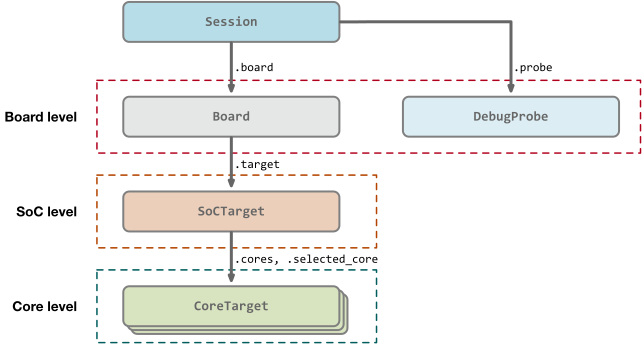

## High level structure

The session and connection to the target and all aspects of the target are representated in pyOCD with a graph of objects constructed at runtime. The diagram below shows an overview of this object graph, focusing on objects that a user of the Python API will interact with.

The connections in the diagram represent composition.

The root of the runtime object graph is a `Session` object. This object holds references to the debug probe and the board. Through the board object, the entire object graph is accessible. It is also responsible for managing per-session options that control various features and settings.

As shown in the diagram, the object graph mirrors the physical structure: board, SoC, and cores. There are many more objects connected with the ones shown here. The Arm ADI debug port (DP) and access ports (APs), other CoreSight components, the memory map, and so on.

## Top level objects

### `Session`

- In `pyocd.core.session`.
- Represents a target connection through a debug probe.
- Root of object graph.
- Owns the `Board` instance, and through that the `SoCTarget` instance.
- Manages session options, user script, and project file access.

### `DebugProbe`

- In `pyocd.probe.DebugProbe`.
- Manages connection to probe.
- Abstracts target control actions.
- Concrete subclasses implement a debug probe’s protocol.
- Returns available instances of a debug probe type. For instance, for listing available probes.
- Can be used alone (without `Target`) for some use cases.
- Each subclass is a plug-in.
- Concrete classes include
    - `CMSISDAPProbe`
    - `STLinkProbe`
    - and more

### `Target`

- In `pyocd.core.target`.
- Defines the abstract API primarily used by scripts.
- Superclass for both SoC and core classes.
- Functionality includes
    - Memory transfers
    - Core register access
    - Reset
    - Run control (halt/step/resume)
    - Breakpoints/watchpoints
    - Misc status
- Defines some enumerations used in many places, such as `Target.ResetType` and `Target.State`.
- Concrete classes include
    - `CoreSightTarget`
    - `CortexM`

## Target classes

These classes are all either direct or indirect subclasses of `Target`.

### `SoCTarget`

- In `pyocd.core.soc_target`.
- Abstract class for the SoC.
- Runs init sequence created by subclass.
- Owns all cores, accessible through the `.cores` dict property.
- Has a notion of a _selected core_.
- Proxies Target methods to the selected core, which makes single-core MCUs transparent.

### `CoreTarget`

- In `pyocd.core.core_target`.
- Abstract class for a processor core.
- Used as a common, architecture-independent superclass for core target classes.
- Doesn't provide much additional functionality on its own.

### `CoreSightTarget`

- In `pyocd.coresight.coresight_target`.
- Concrete SoC class for Arm CoreSight based devices (subclass of `SoCTarget`).
- Used for generic Arm targets such as the `cortex_m` target type.
- Integrates CoreSight discovery into init sequence.
- Owns the DP and APs.

### `CortexM`

- In `pyocd.coresight.cortex_m`.
- Concrete CPU-level target for Arm M-profile cores, subclass of `CoreTarget`.
- Implements most of the `Target` methods.
- Determines CPU type and supported extensions (FPU, etc) by reading ID registers.

