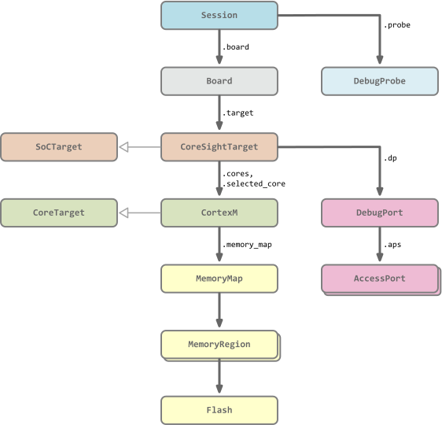

## Object graph

The diagram below shows the most interesting parts of the pyOCD object graph, i.e. those parts
that a user of the Python API will interact with. The connections in the diagram represent
composition, not inheritance.

The root of the runtime object graph is a `Session` object. This object holds references to the debug
probe and the board. It is also responsible for managing per-session options that control
various features and settings.

Attached to the board is a `CoreSightTarget` instance, which represents an MCU. This owns the
CoreSight related objects for communicating with the DP and APs and a `CortexM` object for each CPU
core on the device. Both `CoreSightTarget` and `CortexM` are subclasses of the abstract `Target`
class, which is referenced below, and share most of the same APIs. `CortexM` has a memory map
comprised of `MemoryRegion` objects. The flash memory regions have a `Flash` object to control flash
programming.

## Targets and boards

Target and board support are two separate but related pieces of functionality.

#### Target support

Each supported target enables debugging and flash programming a given MCU. A single target can be
used for potentially multiple boards, or there may not be board with the target. Users can
override the target type on the command line or when creating the `Session`.

Each supported target is defined as a `CoreSightTarget` subclass. Builtin targets are held in a
Python file in the `pyocd/target/builtin` directory. If the target has internal or connected flash,
then a flash algo dict and possibly a `Flash` subclass will be paired with it in the same source
file. The `Flash` subclass is only required if special flash programming semantics are needed,
otherwise the base `Flash` class is automatically used. The flash algo dict and/or `Flash` subclass
are set on flash memory regions when they are created in the memory map. Some device families have
family subclasses under `pyocd/target/family`.

