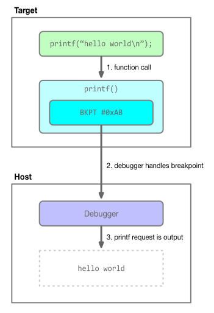

Semihosting is a technique for routing I/O requests performed on the target to the host. In addition to I/O, some other
operations are supported. Most commonly, this means integration of the standard C library with the host's console and
file system. It allows you to log debug messages before you have peripheral drivers fully functioning or on hardware
that does not have other debug output capabilities. It can be used to redirect `printf()` and other standard I/O to or
from the host, read keyboard input, access configuration files, transfer data to and from the target, and so on.

The primary downside to semihosting is that it can be quite slow, depending on how it is used and considerations such
as the debug probe's latency and SWD/JTAG clock speed.

The [Arm semihosting documentation](https://developer.arm.com/documentation/dui0471/i/semihosting/what-is-semihosting-?lang=en)
has more information about semihosting.


### How it works

To implement semihosting, the debugger intercepts requests from code running on the target and performs
the specified action on the target's behalf. Figure 1 below shows how semihosting requests work.

\
**Figure 1**. Semihosting block diagram.

The figure demonstrates and example of how a C standard library call is made to `printf()`. This is routed to a
semihosting handler, which prepares the request parameters and triggers the debugger to perform the request, in this
case writing "hello world" to the console.

For Arm Cortex-M devices, a `BKPT` instruction with a parameter of 0xAB serves as the trigger detected by the debugger.


### Enabling

To use semihosting with pyOCD, it first must be enabled. This can be done in several ways:

- Pass `-S`/`--semihosting` on the `pyocd gdbserver` command line.
- Set the `enable_semihosting` session option to true.
- From gdb, issue a `monitor arm semihosting enable` command. This command is supported for compatibility with OpenOCD.

Assuming the default routing options and telnet port number are acceptable, no further configuration is required. When

<div class="alert alert-info">
Currently semihosting only works when pyOCD's gdbserver is running and the target is resumed, with the gdbserver
waiting for it to halt. However, the <code>pyocd.debug.semihost.SemihostAgent</code> class is reusable if a custom
target control loop is implemented.
</div>


### Routing

There several ways to route semihosting I/O requests in pyOCD, depending on the file on which the request is operating.

First, an I/O request is classified as either "console" or "syscall". Console requests are those that operate on the
first three file descriptions: stdin (0), stdout (1), and stderr (2). Certain semihosting requests are always console.
All other requests, which are always for explicitly opened files, are classified as syscalls.

Console requests have two options for routing, controlled with the `semihost_console_type` session option's value.

- "telnet": I/O is connected to the "telnet" server. (In fact, it's not a true telnet server because it doesn't implement
    the telnet control requests.) This server runs on the port indicated by the `telnet_port` session option or the
    `-T`/`--telnet-port` command line argument of the gdbserver subcommand.
- "console": pyOCD's standard I/O is used.

Syscall requests also have two routing options. The `semihost_use_syscalls` option controls this depending on whether it
is true or false.

- _false_: File I/O requests are handled by pyOCD itself, and therefore are performed on the system on which the pyOCD
    process is running.
- _true_: File I/O is passed to gdb for handling.

Relative paths passed to the `SYS_OPEN` request are interpreted relative to the syscall handler's working directory.
In addition, if pyOCD and gdb are running on different systems, absolute paths will be interpreter according to the
appropriate system's root filesystem.

Defaults are for console to be routed to telnet and syscalls handled by gdb.


### Building into firmware

These are the steps, in short, for how to include semihosting support when linking firmware with gcc
and newlib.

- On the linker command line, add `--specs=rdimon.specs` and ensure `-nostartfiles` is not present.
- Call `initialise_monitor_handles()` from your firmware before using semihosting.

The C runtime stdio will now be connected with semihosting.

This small example shows how to init and use semihosting from gcc.

```c
#include <stdio.h>

extern void initialise_monitor_handles(void);

void main(void) {
    // init semihosting console
    initialise_monitor_handles();

    // say hello via semihosting
    printf("hello, world!\n");
}
```

These blog articles are also very helpful guides for using semihosting with gcc:

- [Introduction to ARM Semihosting](https://interrupt.memfault.com/blog/arm-semihosting) is an excellent
    overall introduction, including how to link in semihosting support for gcc and newlib-based projects.
- [Semihosting with GNU ARM Embedded (LaunchPad) and GNU ARM Eclipse Debug Plugins](https://mcuoneclipse.com/2014/09/11/semihosting-with-gnu-arm-embedded-launchpad-and-gnu-arm-eclipse-debug-plugins/)

For other toolchains, please see the vendor's documentation.


### Trace logging

The semihosting agent supports a trace logger, `pyocd.debug.semihost.trace` that will output a log message every time a
semihosting request is processed. This can be enabled on the command line with `-Lpyocd.debug.semihost.trace=debug`.


### Session options

These are the session options that control semihosting:

- `enable_semihosting` - Set to true to handle semihosting requests.
- `semihost_console_type` - If set to 'telnet' then the semihosting telnet server will be started. If set to 'console' then semihosting will print to pyOCD's console.
- `semihost_use_syscalls` - Whether to use GDB syscalls for semihosting file access operations, or to have pyOCD perform the operations.)
- `telnet_port` - Base TCP port number for the semihosting telnet server. The core number, which will be 0 for the primary core, is added to this value.


### Supported requests

The majority of standard Arm-defined semihosting requests are supported by pyOCD.

- `SYS_OPEN` (0x01): syscall
    - The special file name `:tt` is used to open standard I/O files, per the Arm semihosting specification. The open
    mode selects which standard I/O file is opened. "r" (0) is stdin, "w" (4) is stdout, "a" (8) is stderr. With pyOCD's
    implementation, explicitly opening the standard I/O files is not required.
    - Standard I/O files opened via this request are only accessible when not routing console to the telnet server.
- `SYS_CLOSE` (0x02): syscall
- `SYS_WRITEC` (0x03): console
- `SYS_WRITE0` (0x04): console
- `SYS_WRITE` (0x05): console for stdout and stderr, otherwise syscall
- `SYS_READ` (0x06): console for stdin, otherwise syscall
- `SYS_READC` (0x07): console
- `SYS_ISTTY` (0x09): syscall
- `SYS_SEEK` (0x0a): syscall
- `SYS_FLEN` (0x0c): syscall
- `SYS_REMOVE` (0x0e): syscall
- `SYS_RENAME` (0x0f): syscall
- `SYS_CLOCK` (0x10): returns the number of centiseconds since pyOCD started (technically, since the semihosting agent
    object was created, so this will not line up with timestamps in pyOCD's log output)
- `SYS_TIME` (0x11): returns the number of seconds since midnight, January 1, 1970
- `SYS_ERRNO` (0x13): syscall


The following semihosting requests are not supported. If invoked, the return code is -1 and pyOCD logs a
warning message, such as "Semihost: unimplemented request pc=\<x> r0=\<y> r1=\<z>".

- `SYS_ISERROR` (0x08)
- `SYS_TMPNAM` (0x0d)
- `SYS_SYSTEM` (0x12)
- `SYS_GET_CMDLINE` (0x15)
- `SYS_HEAPINFO` (0x16)
- `angel_SWIreason_EnterSVC` (0x17)
- `SYS_EXIT` (0x18), also called `angel_SWIreason_ReportException`
- `SYS_ELAPSED` (0x30)
- `SYS_TICKFREQ` (0x31)

The [Arm semihosting operations](https://developer.arm.com/documentation/dui0471/i/semihosting/semihosting-operations?lang=en)
documentation has the full specification of each request.


